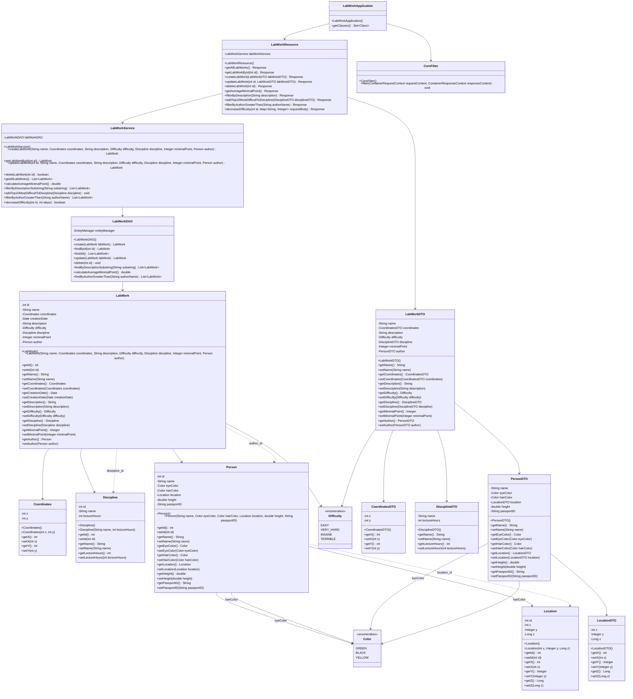

```mermaid
classDiagram
    %% Model Classes
    class LabWork {
        -int id
        -String name
        -Coordinates coordinates
        -Date creationDate
        -String description
        -Difficulty difficulty
        -Discipline discipline
        -Integer minimalPoint
        -Person author
        +LabWork()
        +LabWork(String name, Coordinates coordinates, String description, Difficulty difficulty, Discipline discipline, Integer minimalPoint, Person author)
        +getId() int
        +setId(int id)
        +getName() String
        +setName(String name)
        +getCoordinates() Coordinates
        +setCoordinates(Coordinates coordinates)
        +getCreationDate() Date
        +setCreationDate(Date creationDate)
        +getDescription() String
        +setDescription(String description)
        +getDifficulty() Difficulty
        +setDifficulty(Difficulty difficulty)
        +getDiscipline() Discipline
        +setDiscipline(Discipline discipline)
        +getMinimalPoint() Integer
        +setMinimalPoint(Integer minimalPoint)
        +getAuthor() Person
        +setAuthor(Person author)
    }
    
    class Coordinates {
        -int x
        -int y
        +Coordinates()
        +Coordinates(int x, int y)
        +getX() int
        +setX(int x)
        +getY() int
        +setY(int y)
    }
    
    class Discipline {
        -int id
        -String name
        -int lectureHours
        +Discipline()
        +Discipline(String name, int lectureHours)
        +getId() int
        +setId(int id)
        +getName() String
        +setName(String name)
        +getLectureHours() int
        +setLectureHours(int lectureHours)
    }
    
    class Person {
        -int id
        -String name
        -Color eyeColor
        -Color hairColor
        -Location location
        -double height
        -String passportID
        +Person()
        +Person(String name, Color eyeColor, Color hairColor, Location location, double height, String passportID)
        +getId() int
        +setId(int id)
        +getName() String
        +setName(String name)
        +getEyeColor() Color
        +setEyeColor(Color eyeColor)
        +getHairColor() Color
        +setHairColor(Color hairColor)
        +getLocation() Location
        +setLocation(Location location)
        +getHeight() double
        +setHeight(double height)
        +getPassportID() String
        +setPassportID(String passportID)
    }
    
    class Location {
        -int id
        -int x
        -Integer y
        -Long z
        +Location()
        +Location(int x, Integer y, Long z)
        +getId() int
        +setId(int id)
        +getX() int
        +setX(int x)
        +getY() Integer
        +setY(Integer y)
        +getZ() Long
        +setZ(Long z)
    }
    
    class Difficulty {
        <<enumeration>>
        EASY
        VERY_HARD
        INSANE
        TERRIBLE
    }
    
    class Color {
        <<enumeration>>
        GREEN
        BLACK
        YELLOW
    }
    
    %% Data Transfer Objects
    class LabWorkDTO {
        -String name
        -CoordinatesDTO coordinates
        -String description
        -Difficulty difficulty
        -DisciplineDTO discipline
        -Integer minimalPoint
        -PersonDTO author
        +LabWorkDTO()
        +getName() String
        +setName(String name)
        +getCoordinates() CoordinatesDTO
        +setCoordinates(CoordinatesDTO coordinates)
        +getDescription() String
        +setDescription(String description)
        +getDifficulty() Difficulty
        +setDifficulty(Difficulty difficulty)
        +getDiscipline() DisciplineDTO
        +setDiscipline(DisciplineDTO discipline)
        +getMinimalPoint() Integer
        +setMinimalPoint(Integer minimalPoint)
        +getAuthor() PersonDTO
        +setAuthor(PersonDTO author)
    }
    
    class CoordinatesDTO {
        -int x
        -int y
        +CoordinatesDTO()
        +getX() int
        +setX(int x)
        +getY() int
        +setY(int y)
    }
    
    class DisciplineDTO {
        -String name
        -int lectureHours
        +DisciplineDTO()
        +getName() String
        +setName(String name)
        +getLectureHours() int
        +setLectureHours(int lectureHours)
    }
    
    class PersonDTO {
        -String name
        -Color eyeColor
        -Color hairColor
        -LocationDTO location
        -double height
        -String passportID
        +PersonDTO()
        +getName() String
        +setName(String name)
        +getEyeColor() Color
        +setEyeColor(Color eyeColor)
        +getHairColor() Color
        +setHairColor(Color hairColor)
        +getLocation() LocationDTO
        +setLocation(LocationDTO location)
        +getHeight() double
        +setHeight(double height)
        +getPassportID() String
        +setPassportID(String passportID)
    }
    
    class LocationDTO {
        -int x
        -Integer y
        -Long z
        +LocationDTO()
        +getX() int
        +setX(int x)
        +getY() Integer
        +setY(Integer y)
        +getZ() Long
        +setZ(Long z)
    }
    
    %% Data Access Layer
    class LabWorkDAO {
        -EntityManager entityManager
        +LabWorkDAO()
        +create(LabWork labWork) LabWork
        +findById(int id) LabWork
        +findAll() List~LabWork~
        +update(LabWork labWork) LabWork
        +delete(int id) void
        +findByDescriptionSubstring(String substring) List~LabWork~
        +calculateAverageMinimalPoint() double
        +findByAuthorGreaterThan(String authorName) List~LabWork~
    }
    
    %% Service Layer
    class LabWorkService {
        -LabWorkDAO labWorkDAO
        +LabWorkService()
        +createLabWork(String name, Coordinates coordinates, String description, Difficulty difficulty, Discipline discipline, Integer minimalPoint, Person author) LabWork
        +getLabWorkById(int id) LabWork
        +updateLabWork(int id, String name, Coordinates coordinates, String description, Difficulty difficulty, Discipline discipline, Integer minimalPoint, Person author) LabWork
        +deleteLabWork(int id) boolean
        +getAllLabWorks() List~LabWork~
        +calculateAverageMinimalPoint() double
        +filterByDescriptionSubstring(String substring) List~LabWork~
        +addTop10MostDifficultToDiscipline(Discipline discipline) void
        +filterByAuthorGreaterThan(String authorName) List~LabWork~
        +decreaseDifficulty(int id, int steps) boolean
    }
    
    %% REST Layer
    class LabWorkResource {
        -LabWorkService labWorkService
        +LabWorkResource()
        +getAllLabWorks() Response
        +getLabWorkById(int id) Response
        +createLabWork(LabWorkDTO labWorkDTO) Response
        +updateLabWork(int id, LabWorkDTO labWorkDTO) Response
        +deleteLabWork(int id) Response
        +getAverageMinimalPoint() Response
        +filterByDescription(String description) Response
        +addTop10MostDifficultToDiscipline(DisciplineDTO disciplineDTO) Response
        +filterByAuthorGreaterThan(String authorName) Response
        +decreaseDifficulty(int id, Map~String, Integer~ requestBody) Response
    }
    
    %% Application Class
    class LabWorkApplication {
        +LabWorkApplication()
        +getClasses() Set~Class~*
    }
    
    %% Filter
    class CorsFilter {
        +CorsFilter()
        +filter(ContainerRequestContext requestContext, ContainerResponseContext responseContext) void
    }
    
    %% Relationships
    LabWork --> Coordinates
    LabWork --> Difficulty
    LabWork --> Discipline
    LabWork --> Person
    Person --> Color : eyeColor
    Person --> Color : hairColor
    Person --> Location
    
    LabWorkDTO --> CoordinatesDTO
    LabWorkDTO --> Difficulty
    LabWorkDTO --> DisciplineDTO
    LabWorkDTO --> PersonDTO
    PersonDTO --> Color : eyeColor
    PersonDTO --> Color : hairColor
    PersonDTO --> LocationDTO
    
    LabWorkDAO --> LabWork
    LabWorkService --> LabWorkDAO
    LabWorkResource --> LabWorkService
    LabWorkResource --> LabWorkDTO
    LabWorkApplication --> LabWorkResource
    LabWorkApplication --> CorsFilter
    
    LabWork ..> Discipline : discipline_id
    LabWork ..> Person : author_id
    Person ..> Location : location_id
```